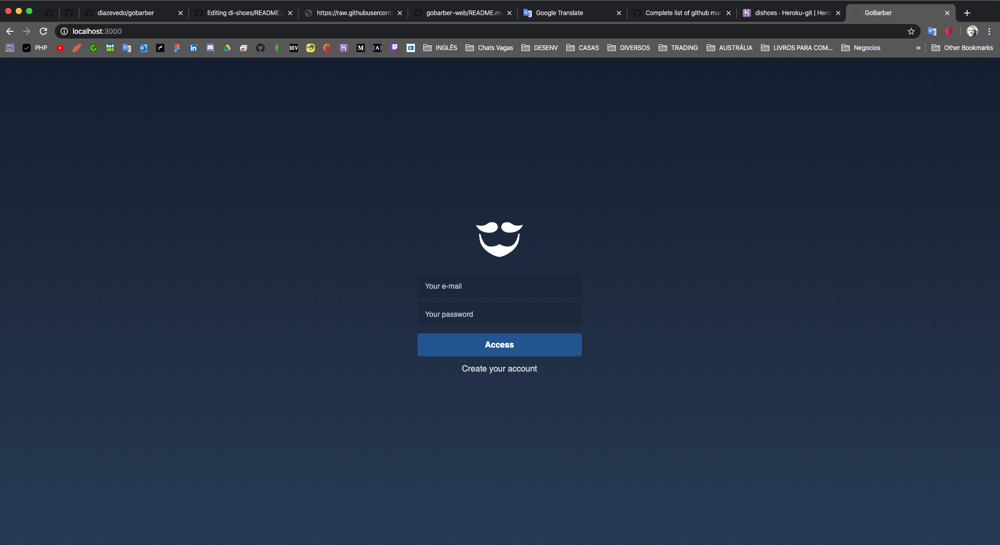
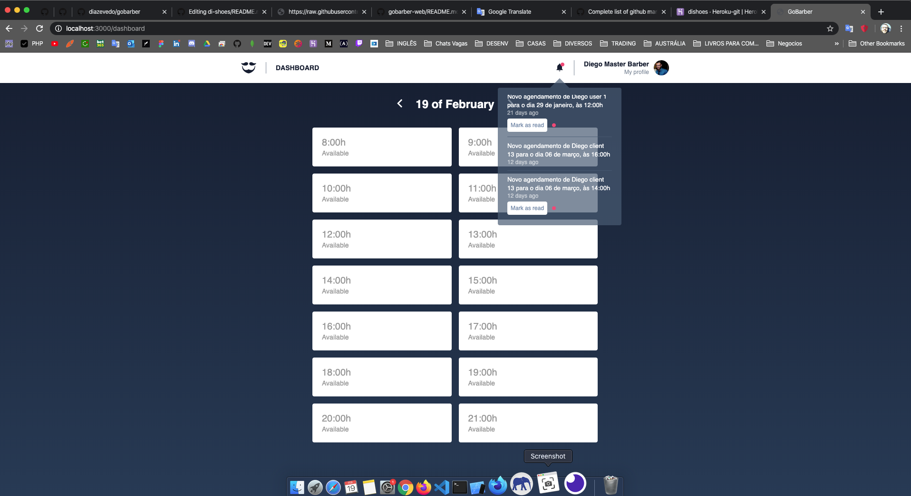
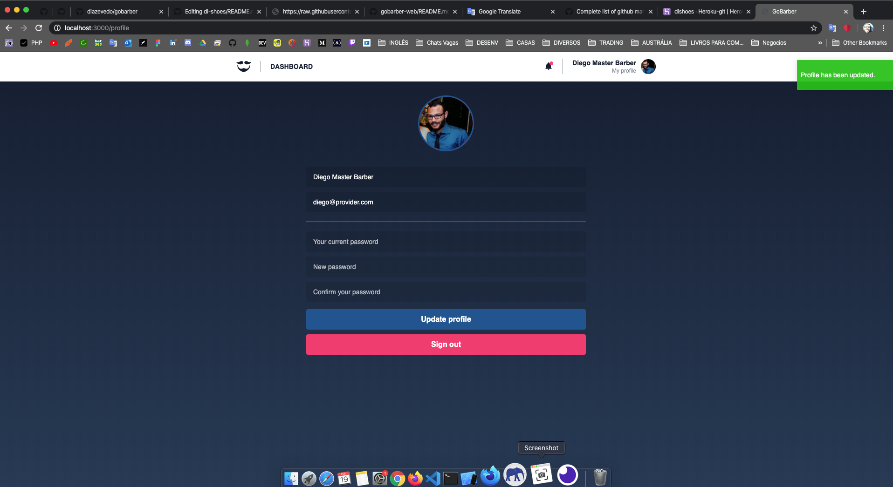

# GoBarber web version

The web version of an application that focuses on helping clients who are looking for barbers. The web version allows professionals to check their agenda.

<table>
  <tr><td colspan=2><strong>iOS</strong></td></tr>
  <tr>
    <td>

</td>
    <td>

</td>
  </tr>
    <tr>
    <td>

</td>
    <td>

</td>
  </tr>
</table>

## Installing / Running

1. Clone it.
2. There is an api that you can clone from here <a href="https://github.com/diazevedo/gobarber"> GoBarber </a>. It has databases as mongo, postgres and redis, so you will need them as well. Sorry if it complicated if you got any better idea please share it.
3. Navigate to the folder `cd gobarber-web`;
4. Run `yarn` or `npm install`;
5. Run `yarn start` or `npm start`
