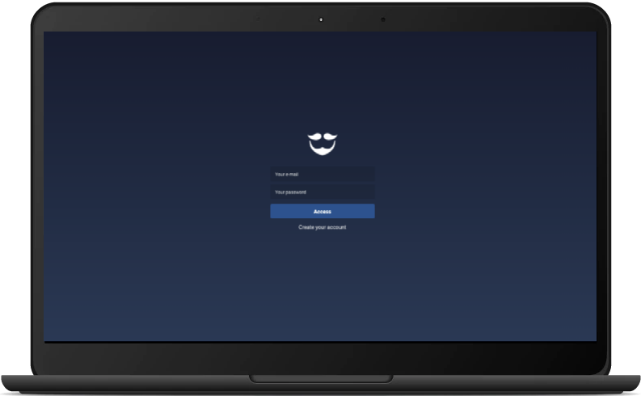
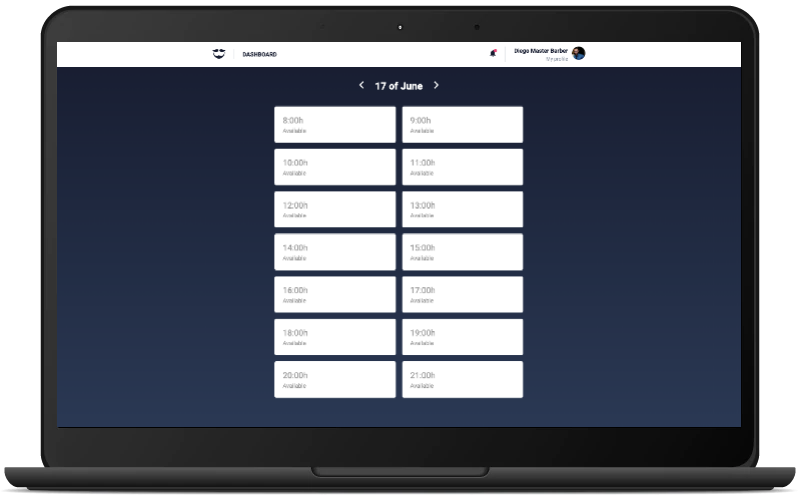

<h1 align="center">
   </br>
    GoBarber
</h1>

<h2 align="center">
  
  
</h2>

<p align="center">
  

  <a href="https://www.linkedin.com/in/diazevedo">
    
  </a>

  
</p>

### Description

The web version of an application that connects barbers and customers. The web version allows professionals to manage their agenda and profile. This project was built during the [Rockeseat Bootcamp](https://rocketseat.com.br/gostack).

It has the [backend](https://github.com/diazevedo/gobarber) and [mobile](https://github.com/diazevedo/gobarber-mobile).

You can access the application [here](https://www.gobarber.dideveloper.com).

### Technologies / Libraries

- [React](https://reactjs.org/)
- [React Select](https://react-select.com/)
- [React Toastify](https://github.com/fkhadra/react-toastify)
- [Redux](https://redux.js.org/introduction/getting-started)
- [Redux Saga](https://redux-saga.js.org/)
- [Styled Components](https://styled-components.com/)

### Running the project

Requirements

- [Node](https://nodejs.org/en/).
- [Yarn](https://yarnpkg.com/) or [NPM](https://www.npmjs.com/) — I am using yarn commands over this step-by-step.
- This project consumes the [API](https://www.github/diazevedo.com/gobarber) so have it running.

```bash
# Open a terminal

# Clone this repository
$ git clone https://github.com/diazevedo/gobarber-web.git

# Go to the repository folder
$ cd gobarber-web

# Run the below command to install dependenciess
yarn

# To run the application
yarn start

# You can go to your browser and create an user
```

:bulb: Feel free to comment or to contribute with this project any thoughts on how to improve are welcome.
